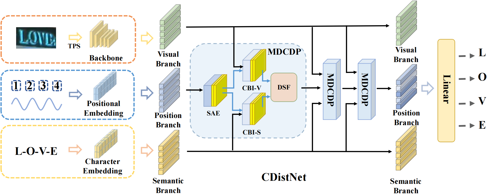

# CDistNet: Perceiving Multi-Domain Character Distance for Robust Text Recognition

The official code of CDistNet.

Paper Link : [Arxiv Link](http://arxiv.org/abs/2111.11011) 



## To Do List
* [x] HA-IC13 & CA-IC13
* [x] Pre-train model
* [x] Cleaned Code
* [ ] Document
* [ ] Distributed Training

## Two New Datasets 
we test other sota method in HA-IC13 and CA-IC13 datasets. 

 
**CDistNet has a performance advantage over other SOTA methods as the character distance increases (1-6)**
### HA-IC13
|Method |1 | 2 | 3 | 4 | 5 | 6 | Code & Pretrain model|
|- | - | - | - | - | - | - | - | 
|VisionLAN (ICCV 2021) | 93.58 | 92.88 | 89.97  | 82.26 | 72.23 | 61.03 | [Offical Code](https://github.com/wangyuxin87/VisionLAN)|
|ABINet (CVPR 2021 ) | 95.92 |95.22 | 91.95 | 85.76 | 73.75 | 64.99 | [Offical Code](https://github.com/FangShancheng/ABINet)|
|RobustScanner* (ECCV 2020) | 96.15 | 95.33 | 93.23 | 88.91 | 81.10 |71.53 | -- |
| Transformer-baseline* | 96.27 | 95.45 | 92.42 | 86.46 | 79.35 | 72.46 | -- |
|CDistNet |**96.62**| **96.15** | **94.28** | **89.96** | **83.43** | **77.71** | -- | 

### CA-IC13
|Method |1 | 2 | 3 | 4 | 5 | 6 | Code & Pretrain model|
|- | - | - | - | - | - | - | - | 
|VisionLAN (ICCV 2021) | 94.87 | 92.77 | 84.01 | 75.03 | 64.29 | 52.74 | [Offical Code](https://github.com/wangyuxin87/VisionLAN)|
|ABINet (CVPR 2021 ) | **96.62** | **95.92** | 87.86 |76.31 | 65.46 | 54.49 | [Offical Code](https://github.com/FangShancheng/ABINet)|
|RobustScanner* (ECCV 2020) | 95.22 | 94.87 | 85.30 | 76.55 | 68.38 |60.79 | -- |
| Transformer-baseline* | 95.68 | 94.40 | 85.88 | 75.85 | 65.93 | 58.58 | -- |
|CDistNet | 96.27 | 95.57 | **88.45** | **79.58** | **70.36** | **63.13** | -- | 


## Datasets
**The datasets are same as ABINet**
- Training datasets

    1. [MJSynth](http://www.robots.ox.ac.uk/~vgg/data/text/) (MJ): 
        - [LMDB dataset BaiduNetdisk(passwd:n23k)](https://pan.baidu.com/s/1mgnTiyoR8f6Cm655rFI4HQ)
    2. [SynthText](http://www.robots.ox.ac.uk/~vgg/data/scenetext/) (ST):
        - [LMDB dataset BaiduNetdisk(passwd:n23k)](https://pan.baidu.com/s/1mgnTiyoR8f6Cm655rFI4HQ)

- Evaluation & Test datasets, LMDB datasets can be downloaded from [BaiduNetdisk(passwd:1dbv)](https://pan.baidu.com/s/1RUg3Akwp7n8kZYJ55rU5LQ), [GoogleDrive](https://drive.google.com/file/d/1dTI0ipu14Q1uuK4s4z32DqbqF3dJPdkk/view?usp=sharing).
    1. ICDAR 2013 (IC13)
    2. ICDAR 2015 (IC15)
    3. IIIT5K Words (IIIT)
    4. Street View Text (SVT)
    5. Street View Text-Perspective (SVTP)
    6. CUTE80 (CUTE)

- Augment IC13
  - HA-IC13 & CA-IC13 : [BaiduNetdisk(passwd:d6jd)](https://pan.baidu.com/s/1s0oNmd5jQJCvoH1efjfBdg), [GoogleDrive](https://drive.google.com/drive/folders/1PTPFjDdx2Ky0KsZdgn0p9x5fqyrdxKWF?usp=sharing)

- The structure of `dataset` directory is
    ```
    dataset
    ├── eval
    │   ├── CUTE80
    │   ├── IC13_857
    │   ├── IC15_1811
    │   ├── IIIT5k_3000
    │   ├── SVT
    │   └── SVTP
    ├── train
    │   ├── MJ
    │   │   ├── MJ_test
    │   │   ├── MJ_train
    │   │   └── MJ_valid
    │   └── ST
    ```
## Environment
package you can find in `env_cdistnet.yaml`.
```
#Installed
conda create -n CDistNet python=3.7
conda install pytorch==1.5.1 torchvision==0.6.1 cudatoolkit=9.2 -c pytorch
pip install opencv-python mmcv notebook numpy einops tensorboardX Pillow thop timm tornado tqdm matplotlib lmdb
```
## Pretrained Models

Get the pretrained models from [BaiduNetdisk(passwd:d6jd)](https://pan.baidu.com/s/1s0oNmd5jQJCvoH1efjfBdg), [GoogleDrive](https://drive.google.com/drive/folders/1PTPFjDdx2Ky0KsZdgn0p9x5fqyrdxKWF?usp=sharing). 
(We both offer training log and result.csv in same file.)
The pretrained model should set in `models/reconstruct_CDistNetv3_3_10`

Performances of the pretrained models are summaried as follows:

[comment]: <> (|Model|GPUs|IC13|SVT|IIIT|IC15|SVTP|CUTE|AVG|)

[comment]: <> (|-|-|-|-|-|-|-|-|-|)

[comment]: <> (|CDistNet&#40;paper&#41;|6|97.67|93.82|96.57|86.25|89.77|89.58|92.28|)

[comment]: <> (|CDistNet&#40;rebuild&#41;|4|97.43|93.51|96.37|86.03|88.68|93.4|92.57|)

## Train
`CUDA_VISIBLE_DEVICES=0,1,2,3 python train.py --config=configs/CDistNet_config.py`
## Eval
`CUDA_VISIBLE_DEVICES=0 python eval.py --config=configs/CDistNet_config.py`
## Citation
```bash 
@article{Zheng2021CDistNetPM,
  title={CDistNet: Perceiving Multi-Domain Character Distance for Robust Text Recognition},
  author={Tianlun Zheng and Zhineng Chen and Shancheng Fang and Hongtao Xie and Yu-Gang Jiang},
  journal={ArXiv},
  year={2021},
  volume={abs/2111.11011}
}
```
